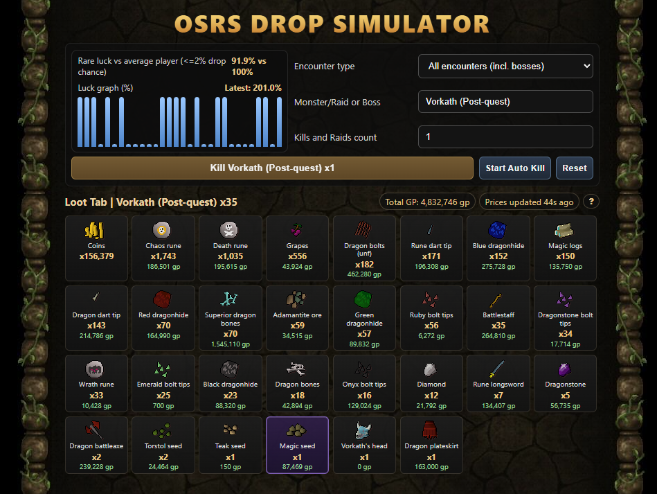

# OSRS Drop Simulator

A fan-made **Old School RuneScape** drop simulator in the browser. Pick a boss, raid, or custom encounter, run kills in batches (or auto-kill), and watch loot stack up with **live Grand Exchange prices** and a simple **luck vs. rare-table** view.

**Live site:** [osrs-drop-simulator.com](https://osrs-drop-simulator.com)

---

<p align="center">
  
</p>

<p align="center">
  <em>Encounter selection, RNG luck graph, and aggregated loot with per-item GE value.</em>
</p>

---

## Features

- **Encounters** — Filter by all bosses, raids, or DT2; optional **hard mode** (CM / HM / awakened) where the model applies higher unique rates for relevant content.
- **Raid-aware models** — Simplified purple / unique handling for **Chambers of Xeric** (points), **Theatre of Blood** (team size, deathless toggle), **Tombs of Amascut** (raid level + entry-mode style gating), plus **Barrows** reward potential for scaled commons.
- **Loot tab** — Icons (RuneLite / wiki fallbacks), stack quantities with tier styling, **total GP**, and a **?** help modal that explains how the sim works.
- **Luck panel** — Compares simulated rare luck to a 100% baseline and shows a small **luck history** sparkline per batch.
- **Persistence** — Per-monster kill totals stored locally so your “account” stats survive refreshes (same browser).

## Tech stack

- [React](https://react.dev/) 19 + [TypeScript](https://www.typescriptlang.org/)
- [Vite](https://vite.dev/) 8
- Data and prices from the **OSRS Wiki** ecosystem (see in-app footer)

## Development

```bash
npm install
npm run dev
```

Production build:

```bash
npm run build
npm run preview   # optional local check of dist/
```

Lint:

```bash
npm run lint
```

## Monster data

Monster drop tables are loaded from public **osrsbox** JSON mirrors (GitHub / jsDelivr) configured in `src/app/constants.ts`. Custom encounters (e.g. specific raid stubs) live in `src/app/custom-encounters.ts`.

You can optionally add `public/monsters-complete.json` and prepend `"/monsters-complete.json"` to `MONSTER_URLS` for offline or faster first-hop loads (see comment in `constants.ts`).

## Disclaimer

This is an **independent fan project**. It is not affiliated with, endorsed by, or supported by **Jagex** or the **Old School RuneScape Wiki** staff. Drop logic is a **simplified model**, not game source code—use it for fun and rough estimates, not as a guarantee of in-game behaviour.

---

*Created by **SoP crVek** — enjoy the grind without the supply cost.*
